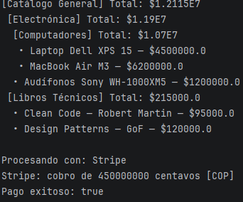
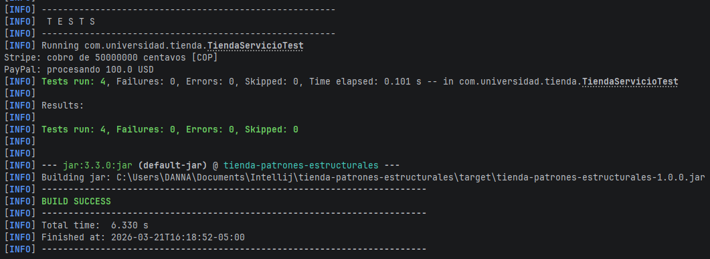

# Tienda Patrones Estructurales

## Descripción
Proyecto desarrollado en Spring Boot donde se implementan los patrones estructurales:

- Adapter (Stripe y PayPal como pasarelas de pago)
- Composite (estructura de categorías y productos)

## Cómo ejecutar el proyecto

1. Clonar repositorio
2. Ejecutar:

mvn clean package

3. Luego:

mvn spring-boot:run

## Tests

Para ejecutar pruebas:

mvn test

## Ejecucion 

## Tests

